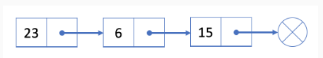

单链表

双链表

```
struct node{
    int val;
    node* next;
    node(int x): val(x),next(NULL) {}
};

访问O(n)
插入O(1)
删除O(n): 需要找到当前节点的上一个节点O(n)
```


```
#双指针技巧
两种方式：
	1. 两个指针从不同位置出发： 一个从开始端，一个从末端。
	2. 两个指针以不同的速度移动，一个指针快，一个指针慢。

单链表只能使用2
```

```
快慢指针自己的理解
首先明确快指针一定能够追上慢指针
假设 1 -> 2 -> 3 -> 4 -> 5
然后5跟3连在了一块
设从头走到尾的话需要n步， 这里n=4
设链表中属于环的步数是m, 这里m=2
那么慢指针入环也就是到达3的时候就走了n-m 步， n-m = 2
快指针 走了2(n-m) 步。
这是假设链表头变成了3, 那个慢指针的index=0, 因为他就指向3.
那快指针呢， 快指针的位置变成了 (n-m)%(m+1) , (4 - 2) % (2 + 1) = 2, 快指针指向5,假设3为链表头的话，它的index=2.
那么快指针和慢指针之间的距离是多少呢？ distance = (m+1) - (n-m)%(m+1) = 1
也就是说慢指针与快指针之间相差一步。所以快慢指针在走distance步就能够相遇了， 那相遇时在环中（以3为链表头）的位置是多少呢， 就是distance: (m+1) - (n-m)%(m+1).
现在假设把快指针扔掉，光慢指针走， 慢指针需要走多少步才能到3也就是环头呢？
(m+1) - distance就可以了，也就是 (n-m)%(m+1)
我们在假设(n-m)是小于m+1的， 那么(n-m)%(m+1) = (n-m)
(n-m) 很神奇， 就是原来的慢指针从链表头走到环入口的步数，所以如果想要得到环的入口，只需要在快慢指针相遇的时候，另设一个指针设为P指向原来的链表头，这个指针也是个慢指针，然后两个慢指针一起走，相遇的时候就是环的入口了。因为走(n-m)步两者都会到达环的入口。
那（n-m）大于 m+1 了呢，指针P走的步数还是(n-m)就能到达环入口，而原始的慢指针虽然走了(n-m)步，但是只有(n-m)%(m+1)步是有效的，别的都是转圈，所以原始慢指针走了(n-m)步后仍会与指针P在环入口相交。

```


​	快慢指针一定要考虑特殊情况： 只要需要ptr->next, 一定要排除ptr为空的情况。